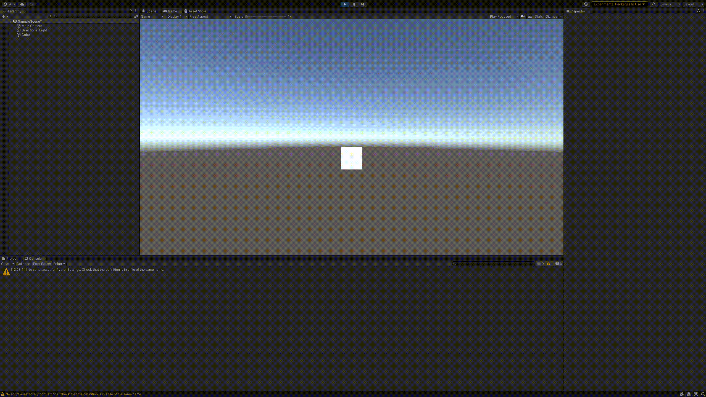
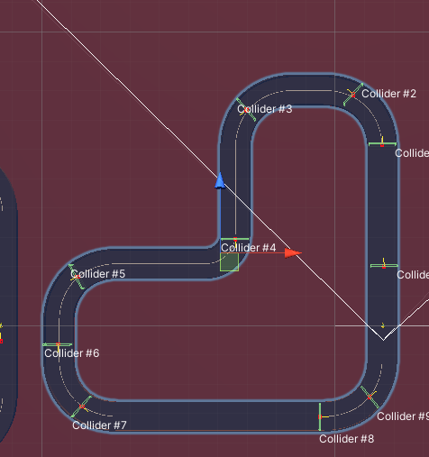
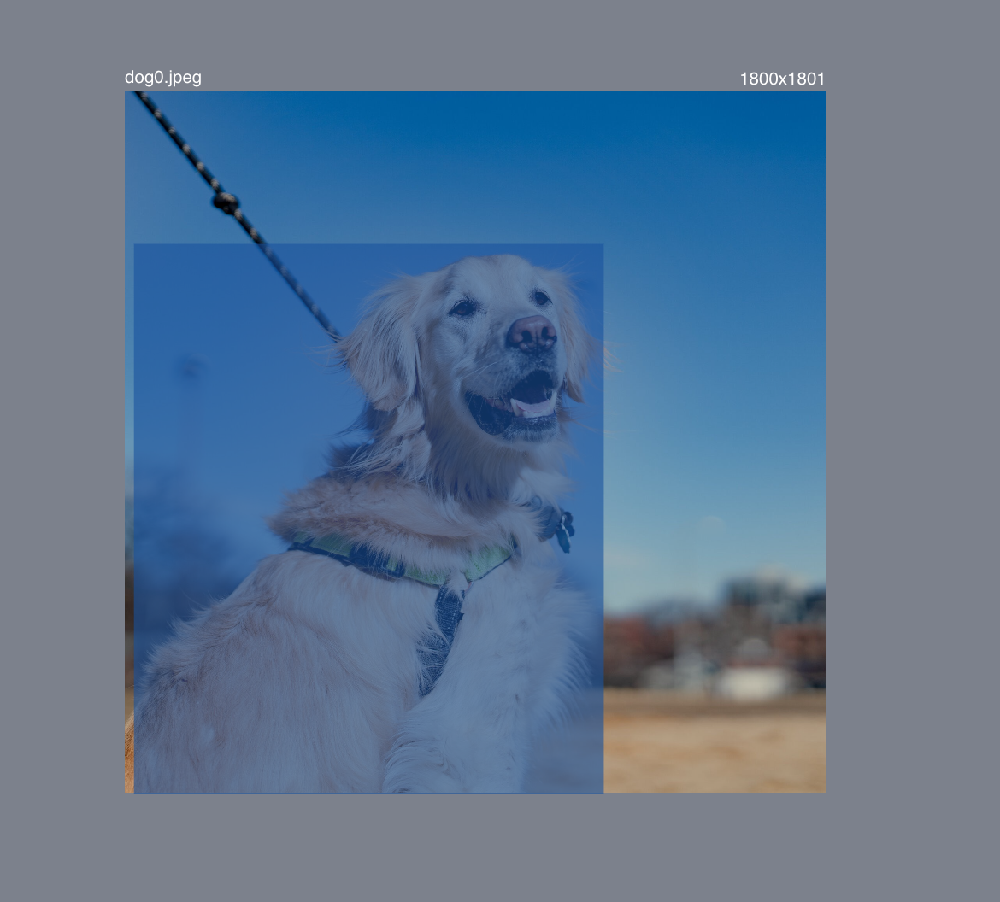
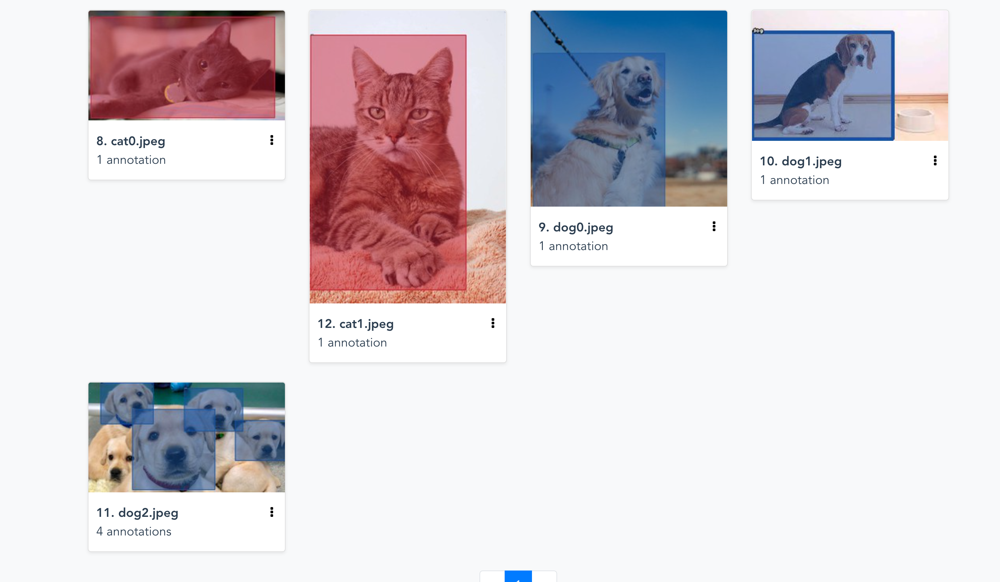

# CMPE-295
Interactive Augmented Reality for Semantic Segmentation on Indoor Environments

    install unity
    Client server communication python -> unity (TCPIP?)
    Python (hello world) displayed under unity
    Unity create simple 3D object such as a cube
    Use python to move the cube up then down, left then right
    Have image from python sent to unity and display image: 
    Perform on virtual screen in unity
    Send video to virtual display screen directly from camera such as youtube or webcam
    Later do a video from file or webcam
    Establish readme for each task

1. Install Unity

2. Python hello world displayed under unity

3. Unity create 3D object such as a cube and use python to move the cube up then down, left then right

- Modified code from [here](https://github.com/CanYouCatchMe01/CSharp-and-Python-continuous-communication)
  to move the cube up and down, left and right
   

## Unity ML Tutorial

1. Install Unity Kart Racing [here](https://learn.unity.com/project/karting-template)
2. Complete the In-editor Tutorials
3. Follow Kart ML Agent Tutorial [here](https://www.youtube.com/watch?v=gYwWolRFt98)
   - Kart Classic Training Demo Scene
   - Train agent to achieve a goal such as driving without colliding with the track walls
   - Academy collects all observations done by the agents and trains the agents
   - Kart ML Agent behaivor parameters allows us to define how the agent interacts
 - 
- Connect Install Python-Unity-ML Dependencies inside of the unity project directory  with the following command 
  - `pip install -Iv mlagents==0.13.0`
- Create new Kart Academy prefab
- create Training environment Game object
-  To run training run:
   -  ` mlagents-learn Assets/Karting/Prefabs/AI/kart_mg_trainer_config.yaml --train --run-id=custom-track-1`
   -  Yielded compatibility error between unity and mlagents in python:
"Traceback (most recent call last):
  File "/Users/adam/opt/anaconda3/lib/python3.7/multiprocessing/process.py", line 297, in _bootstrap
    self.run()
  File "/Users/adam/opt/anaconda3/lib/python3.7/multiprocessing/process.py", line 99, in run
    self._target(*self._args, **self._kwargs)
  File "/Users/adam/Desktop/SJSU/CMPE295A/CMPE-295/Unity_Tutorial/Unity Karting MicroGame Tutorial/venv/lib/python3.7/site-packages/mlagents/trainers/subprocess_env_manager.py", line 100, in worker
    worker_id, [shared_float_properties, engine_configuration_channel]
  File "/Users/adam/Desktop/SJSU/CMPE295A/CMPE-295/Unity_Tutorial/Unity Karting MicroGame Tutorial/venv/lib/python3.7/site-packages/mlagents/trainers/learn.py", line 425, in create_unity_environment
    side_channels=side_channels,
  File "/Users/adam/Desktop/SJSU/CMPE295A/CMPE-295/Unity_Tutorial/Unity Karting MicroGame Tutorial/venv/lib/python3.7/site-packages/mlagents_envs/environment.py", line 135, in __init__
    f"The API number is not compatible between Unity and python. "

## YoloACT

1. Install YoloACT [here](https://github.com/dbolya/yolact)
   - YoloAct requires CUDA to run, my local computer does not have NVIDIA GPU
   - May need to clone the repo to SJSU HPC1 to run FULL YOLOACT with CUDA
   - Or Use Google Colab to run YoloACT

2. For now running in Google Colab [here](https://colab.research.google.com/drive/1ncRxvmNR-iTtQCscj2UFSGV8ZQX_LN0M)

## COCO Annotator

1. Follow this [tutorial](https://www.youtube.com/watch?v=OMJRcjnMMok)
2. Install COCO Annotator [here](https://github.com/jsbroks/coco-annotator/wiki/Getting-Started)
3. Run the Docker container
4. Go to `localhost:5000`
5. Annotated custom dataset containing cats and dogs
   1. Created bounding box around images:

      
    1. Exported annotations as JSON file

      

      `{"images": [{"id": 8, "dataset_id": 3, "category_ids": [], "path": "/datasets/Pets/cat0.jpeg", "width": 1240, "height": 698, "file_name": "cat0.jpeg", "annotated": false, "annotating": [], "num_annotations": 0, "metadata": {}, "deleted": false, "milliseconds": 0, "events": [], "regenerate_thumbnail": false}`
