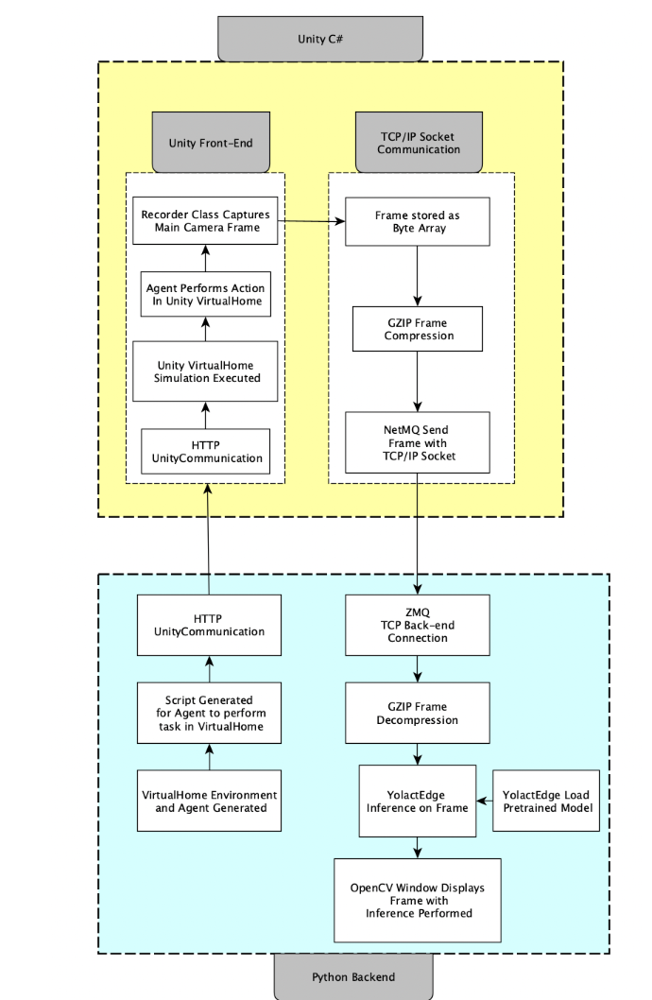

# Interactive Augmented Reality for Semantic Segmentation on Indoor Environments

# Introduction

This project is primarily focused on the navigation of an autonomous agent within a virtual environment created with the help of Unity; a tool primarily used to develop simulations for computers, consoles, and mobile devices. The agent would perform trivial tasks such as retrieving an object from its surroundings or avoiding obstacles, among other things. The agent will need access to instance segmentation models, such as YOLACT, a framework suited to recognize target items. Moreover, with the help of specific packages like ml-agents available within Unity [1 (Unity Technologies 2022)], it is possible to create a virtual environment where multiple simulations can be performed to test the capabilities of real-world robotics within a safe, isolated environment.

# Project Architecture

The Python script generates the VirtualHome environment and agent, followed by the creation of a script containing the tasks for the agent to perform within the virtual environment. Communication between the Python script and the Unity VirtualHome environment is established through an HTTP Unity Communication protocol. On the Unity side, an HTTP Unity receiver processes the incoming message from the Python script. This triggers the execution of the Unity VirtualHome simulation, where the agent performs the specified actions in the virtual environment. A Recorder class captures the main camera frame, which is then stored as a byte array in the Unity backend. To optimize data transfer efficiency, the frame is compressed using the GZIP compression algorithm [2 (n.a. n.d.)]. The compressed frame is then sent from the Unity environment to the Python script using TCP/IP Socket Communication facilitated by the NetMQ library. Upon receiving the frame, the Python script uses the ZeroMQ (ZMQ) library [3 (n.d. 2022)] to handle the TCP/IP Socket Communication. The GZIP-compressed frame is decompressed, and the YolactEdge [4 (Liu 2020)] pretrained model is loaded for inference. The YolactEdge instance segmentation algorithm processes the received frame, and the resulting segmented frame is displayed using the OpenCV library.

#  TCP/IP Socket Communication

To achieve real-time object detection and segmentation in Unity, we used IP socket communication through the NetMQ library to exchange data between our C# application and the YolactEdge Python program. Our C# app acted as the client, sending captured frames over the socket to the Python server.
To optimize data transfer, we used GZIP file compression on each frame before sending it over the socket. This resulted in faster processing times and reduced bandwidth requirements.
To ensure reliable data transfer, we used the TCP/IP protocol. The YolactEdge program received the compressed frame, decompressed it, and performed instance segmentation using YolactEdge weights and object classes. Results were then rendered using OpenCV in a generated window.
Overall, IP socket communication and file compression enabled seamless communication between the two applications, enabling real-time inference from frames in the Unity VirtualHome environment.

# Data Generation Using Unity's Package SyntheticHomes 

In order to generate synthetic training data with object instance annotations as ground truth labels, the configuration file of the Unity Synthetic Homes application was modified. Specifically, the furniture types, configurations, and camera angles were adjusted according to the needs of the project. Additionally, the number of image iterations was set to 600 to generate a sufficient amount of synthetic data for model training.

# Dataset Curation and Processing with FiftyOne

To prepare the dataset generated with Unity Synthetic Homes for training with YolactEdge, FiftyOne was used to filter classes for training, combine classes, and limit it to only instance annotations. FiftyOne was also used to visualize and gain insight into the class object distribution, which helped in preparing the dataset for training with YolactEdge. Additionally, FiftyOne was used to perform a train/val split of the dataset to ensure that the model was not overfitting to the training data. During this process, object classes such as Table_Dining, Table_Coffee, and Table_End were combined into a single category "table" to simplify the training process and improve model accuracy.

# Accessing the HPC
Accessing the high-performance computing (HPC) system at SJSU requires several steps. These detailed steps have been laid out in the documentation.

# YolactEdge Implementation

YolactEdge is a deep learning model that performs instance segmentation in real-time and runs accurately on edge devices at real-time speeds. YolactEdge leverages TensorRT, a high-performance deep learning inference library, to achieve fast and accurate inference on NVIDIA GPUs.

In this use case, a YolactEdge model is trained to provide real-time instance segmentation inference within the Unity virtualhome environment. To achieve real-time inference, the power of TensorRT, a high-performance deep learning inference library, was leveraged. Additionally, the NetMQ library was used to perform TCP/IP socket communication between UnityVirtualHome and the YolactEdge inference model.
The training data used to develop the YolactEdge model was synthetically generated from Unity, simulating a diverse range of real-world scenarios. To generate the ground truth annotations for this data, the household assets available in the Unity SyntheticHome application were utilized, which automatically generated accurate annotations for each object in the scene.
The integration of NetMQ allowed for a reliable and fast communication channel between Unity and YolactEdge. Every frame generated in Unity is compressed and sent to YolactEdge for prediction with minimal delay. This entire pipeline runs at around 10-15 fps on an Nvidia GTX 1080 ti, which is suitable for many real-time applications.

# Unity VirtualHome Implementation

The implementation of Unity VirtualHome, a platform that simulates household activities with humanoid avatars. It demonstrates how to generate and run an agent's script to perform tasks within VirtualHome using the Python API. A code snippet is provided to show the process of interacting with objects and executing household tasks, such as turning on lights, moving objects, and operating appliances. The integration of YolactEdge for object detection and segmentation in real-time video feeds is also discussed, demonstrating the potential for simulating and testing robotic applications in a realistic home environment.

# Built With

This section lists major frameworks and libraries that were used to create the project. The following plugins were used:

* 
  - Open-source computer vision and machine learning software library
* 
  *  Open-source deep learning framework used for computer vision tasks
* 
  * Cross-platform game engine used for developing 2D and 3D games and simulations
* 
  * Research platform for simulating domestic environments with a variety of interactive objects

* 
  * Computer vision and machine learning toolkit for Unity used for developing perception-driven applications
* 
  * Python package for exploring and analyzing computer vision datasets
* 
  * Real-time instance segmentation algorithm that detects and segments objects in images and videos
* 
  * Lightweight version of YOLACT that is optimized for edge devices and embedded systems
* 
  * High-performance asynchronous messaging library that facilitates communication between distributed applications

(<a href="#readme-top">back to top</a>)

# Citations

[1] Unity Technologies, “Machine Learning Agents,” Unity. [Online]. Available: https://unity.com/products/machine-learning-agents. [Accessed: 30-Nov-2022].
[2] “The gzip home page,” Gzip.org. [Online]. Available: https://www.gzip.org/. [Accessed: 09-May-2023].
[3] zeromq, "get-started," 2022. [Online]. Available: https://zeromq.org/get-started/.
[4] H. Liu, R. A. R. Soto, F. Xiao, and Y. J. Lee, “YolactEdge: Real-time instance segmentation on the edge,” arXiv [cs.CV], 2020.

# Acknowledgements

YolactEdge: We would like to acknowledge the use of YolactEdge in our work. YolactEdge was developed by Haotian Liu, Rafael A. Rivera Soto, Fanyi Xiao, and Yong Jae Lee, and is based on the YOLACT algorithm presented by Daniel Bolya, Chong Zhou, Fanyi Xiao, and Yong Jae Lee in their 2019 ICCV paper.
VirtualHome: We would like to acknowledge the use of VirtualHome, a household activity simulator developed by Xavier Puig, Kevin Ra, Marko Boben, Jiaman Li, Tingwu Wang, Sanja Fidler, and Antonio Torralba, in our work.
SyntheticHomes: We would like to acknowledge the use of Unity Synthetic Homes, a platform developed by Unity Technologies, in our work. Synthetic Homes provides a powerful tool for creating virtual household environments for training AI models.
