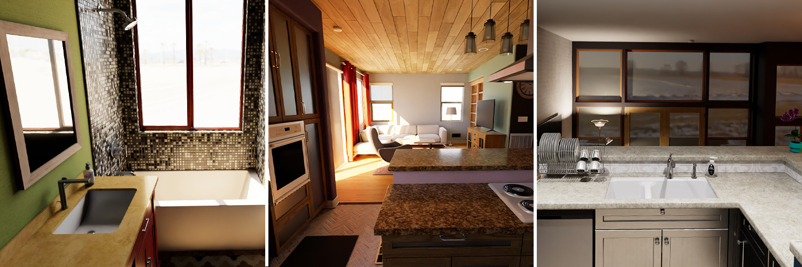
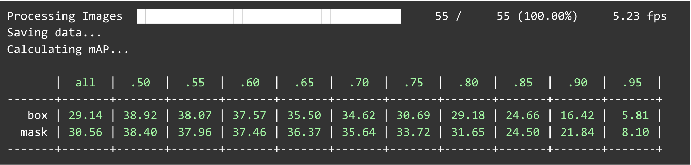

<!-- Improved compatibility of back to top link: See: https://github.com/othneildrew/Best-README-Template/pull/73 -->

<!--
*** Thanks for checking out the Best-README-Template. If you have a suggestion
*** that would make this better, please fork the repo and create a pull request
*** or simply open an issue with the tag "enhancement".
*** Don't forget to give the project a star!
*** Thanks again! Now go create something AMAZING! :D
-->

<!-- PROJECT SHIELDS -->
<!--
*** I'm using markdown "reference style" links for readability.
*** Reference links are enclosed in brackets [ ] instead of parentheses ( ).
*** See the bottom of this document for the declaration of the reference variables
*** for contributors-url, forks-url, etc. This is an optional, concise syntax you may use.
*** https://www.markdownguide.org/basic-syntax/#reference-style-links
-->

[![MIT License][license-shield]][license-url]

# Instance Segmentation with Unity VirtualHome Environment

**Primary Author:** Adam Goldstein  
**Co-Authors:** Ryan Cummings, Aishwarya Paruchuri, Krupa Kothadia  
**Advisor:** Dr. Harry Li  
**Affiliation:** San Jose State University, Department of Computer Engineering

## Project Overview

- **Objective**: Develop a real-time object detection and segmentation system for Unity VirtualHome to enhance computer vision applications in virtual environments
- **Method**: Utilize YolactEdge, a state-of-the-art instance segmentation algorithm implemented with PyTorch, to perform real-time object detection and segmentation on frames generated within the Unity VirtualHome environment
- **Synthetic Data**: Generate and curate synthetic data for training the YolactEdge model using Unity SyntheticHomes and FiftyOne dataset processing tools
- **Integration**: Optimize YolactEdge for real-time performance within Unity using TCP/IP socket communication via NetMQ and ZeroMQ messaging libraries

### YolactEdge: A State-of-the-Art Instance Segmentation Algorithm
- **State-of-the-art-performance**: YolactEdge provides competitive instance segmentation results compared to other algorithms, making it a suitable choice for real-time applications
- **Real-time Processing**: YolactEdge is designed for efficient, real-time object detection and segmentation, which is critical for seamless integration into the Unity VirtualHome environment
- **TensorRT Optimization**: YolactEdge leverages GPU acceleration and is compatible with NVIDIA's TensorRT, a high-performance deep learning inference optimizer, enabling faster processing
- **Lightweight architecture**: The model's architecture is less complex and resource-intensive than alternative approaches, making it ideal for implementation in a real-time system

### Unity VirtualHome: A Versatile Environment for Computer Vision Applications

- **Immersive Simulation**: Unity VirtualHome offers a realistic and customizable 3D environment that replicates various indoor scenarios, ideal for developing and testing computer vision applications
- **Rapid Prototyping**: The platform enables quick development and iteration of virtual scenarios, reducing the time and resources needed for real-world testing

### System Architecture

  <ul>
    <li><strong>Architecture Diagram</strong> : Shows interface between Python script and Unity VirtualHome for object detection and segmentation with YolactEdge</li>
    <li><strong>Communication</strong>: with NetMQ used for TCP/IP Socket Communication to send compressed frames from Unity to Python script</li>
    <li><strong>YolactEdge</strong>: model loaded for inference and OpenCV used to display segmented frames, enabling real-time object detection and segmentation in virtual environment</li>
  </ul>
  

### Unity SyntheticHomes

- **Cost-effective**: Training on synthetic data reduces the need for expensive and time-consuming real-world data collection
- **Customizable**: Synthetic data generation allows for control over the scenarios, objects, and conditions, enabling targeted model training
- **Scalability**: Large volumes of diverse synthetic data can be generated quickly, providing a rich training set for the model

### FiftyOne Data Annotation Tools

- **Efficient Annotation**: FiftyOne streamlines the process of labeling and annotating synthetic data, ensuring accurate and consistent training input
- **Quality Control**: FiftyOne enables easy visualization and inspection of annotated data, allowing for quality checks and refinements

### Integration with VirtualHome using TCP/IP Socket Communication

- **Seamless data transfer**: Implementing TCP/IP socket communication with NetMQ and ZeroMQ messaging libraries enables efficient data exchange between the Unity application and the YolactEdge Python program
- **Real-time Performance**: This integration approach supports real-time object detection and segmentation within the Unity VirtualHome environment

### Training Results

The Mean Average Precision (mAP) metric is used to evaluate the performance of the YolactEdge model on the Unity SyntheticHomes dataset

### 

- **Custom Trained Model**: The model was trained on the Unity SyntheticHomes dataset for 40,000 iterations, achieving an overall mask mAP of 30.6

- **Pretrained Model**: The model was pretrained trained on the COCO dataset and then resumed on SyntheticHomes Data, achieving an overall mask mAP of 56.8

### Built With

<ul style="display:flex; flex-wrap:wrap; list-style:none;">
  <li style="margin-right:10px;">
    
  </li>
  <li style="margin-right:10px;">
    
  </li>
  <li style="margin-right:10px;">
    
  </li>
  <li style="margin-right:10px;">
    
  </li>
  <li style="margin-right:10px;">
    
  </li>
  <li style="margin-right:10px;">
    
  </li>
  <li style="margin-right:10px;">
    
  </li>
  <li style="margin-right:10px;">
    
  </li>
  <li style="margin-right:10px;">
    
  </li>
</ul>

(<a href="#readme-top">back to top</a>)

<!-- GETTING STARTED -->
## Getting Started

To recreate the project, follow the instructions located in the documents folders. The documents folder contains the following files:

* [Synthetic Homes Data Generation](documentation/SyntheticHomes_Data_Generator_README.pdf)
* [YolactEdge Installation, Training, and Inference](documentation/YolactEdge_Instance_Segmentation_README.pdf)
* [Fiftyone Installations and Usage](documentation/FiftyOne_README.pdf)
* [Unity Virtual Home Installations and Usage](documentation/Unity_VirtualHome_README.pdf)

### Prerequisites

*  Computer Specifications
  * Intel i5 9600k
  * GTX 1080 ti (11gb ram)
  * 32gb memory
* Operating System
  * Ubuntu 20.04
  * Windows 10

<!-- LICENSE -->
### License

Distributed under the MIT License. See `LICENSE.txt` for more information.

<!-- CONTACT -->
### Contact

Email - [@adkap2](mailto:adkap2@gmail.com)

<!-- ACKNOWLEDGMENTS -->
### Acknowledgments

* [YolactEdge](https://github.com/razorx89/YOLACTEdge/): We would like to acknowledge the use of YolactEdge in our work. YolactEdge was developed by Haotian Liu, Rafael A. Rivera Soto, Fanyi Xiao, and Yong Jae Lee, and is based on the YOLACT algorithm presented by Daniel Bolya, Chong Zhou, Fanyi Xiao, and Yong Jae Lee in their 2019 ICCV paper.
* [VirtualHome](http://virtual-home.org/): We would like to acknowledge the use of VirtualHome, a household activity simulator developed by Xavier Puig, Kevin Ra, Marko Boben, Jiaman Li, Tingwu Wang, Sanja Fidler, and Antonio Torralba, in our work.
* [SyntheticHomes](https://github.com/Unity-Technologies/SyntheticHomes): We would like to acknowledge the use of Unity Synthetic Homes, a platform developed by Unity Technologies, in our work. Synthetic Homes provides a powerful tool for creating virtual household environments for training AI models.

(<a href="#readme-top">back to top</a>)

<!-- MARKDOWN LINKS & IMAGES -->
<!-- https://www.markdownguide.org/basic-syntax/#reference-style-links -->
[contributors-shield]: https://img.shields.io/github/contributors/othneildrew/Best-README-Template.svg?style=for-the-badge

[contributors-url]: https://github.com/adkap2/Instance-Segmentation-with-Unity-Interactive-Augmented-Reality/graphs/contributors
[forks-shield]: https://img.shields.io/github/forks/othneildrew/Best-README-Template.svg?style=for-the-badge
[forks-url]: https://github.com/othneildrew/Best-README-Template/network/members
[stars-shield]: https://img.shields.io/github/stars/othneildrew/Best-README-Template.svg?style=for-the-badge
[stars-url]: https://github.com/othneildrew/Best-README-Template/stargazers
[issues-shield]: https://img.shields.io/github/issues/othneildrew/Best-README-Template.svg?style=for-the-badge
[issues-url]: https://github.com/othneildrew/Best-README-Template/issues
[license-shield]: https://img.shields.io/github/license/othneildrew/Best-README-Template.svg?style=for-the-badge
[license-url]: https://github.com/othneildrew/Best-README-Template/blob/master/LICENSE.txt
[linkedin-shield]: https://img.shields.io/badge/-LinkedIn-black.svg?style=for-the-badge&logo=linkedin&colorB=555
[linkedin-url]: https://www.linkedin.com/in/adam-goldstein123/
[product-screenshot]: images/screenshot.png
